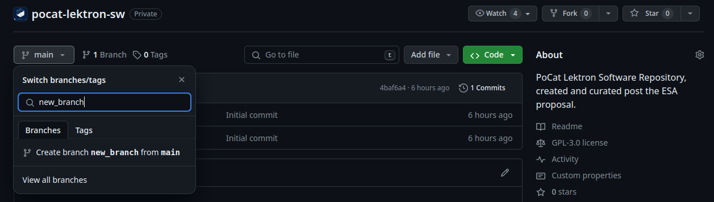

# PoCAT Lektron

This repository is a new version of the repository for the PoCat-Lektron team. This repository intended to avoid the use of the STM32CubeIDE. As it was a non-opensource product and has some problems at the time to install it. 

## Contents
1. [Requirements](#requirements)
2. [Repository Organization](#organization)
3. [Tools](#tools)
4. [Git Basics](#git-basics)
5. [Coding Conventions](#coding-conventions)
6. [Semantic Versioning](#semantic-versioning)
7. [Workflow](#workflow)
8. [Licence](#license)

## 1. Requirements

Firstly, here are the essential requirements in order to be able to work. Please check that you have all the software up to date, or just install it.

- **CMake & C Standard**: Version 2.16 or higher, and version 11 or higher respectively. For those Linux users it is strongly recommended installing the build essential package:

        sudo apt update
        sudo apt install build-essential

- **gcc-9-2020-q2-update**: The GNU Arm Embedded Toolchain for C and C++ tools and assembly programs. (Available [here](https://developer.arm.com/downloads/-/gnu-rm/9-2020-q2-update)). For those Linux users:

        sudo apt update
        sudo apt install gcc-arm-none-eabi

- **STM32CubeProgrammer**: Needed to update the firmware and detect the board. It can also be used to configure the ST-Link. It is available [here](https://www.st.com/en/development-tools/stm32cubeprog.html).

- **ST-Link V2 interface**: This is needed to program the PocketQubes or by developing the code on the ST-Link V2. Please contact any of the contributors to get one.

- **Git**: To track the code and have version control. Available [here](https://git-scm.com/downloads) for all platforms. For those Windows users GitHub Desktop client is also available [here](https://desktop.github.com/). For Linux users:
        
        sudo apt update
        sudo apt-install git 

## 2. Repository Organization

This repository aims to maintain a simple organization, so newcomers can adapt easily. It has 5 directories:

- **`cmake/`**: Contains the CMake configuration files. (Startup assembly file, linker scripts for the flash and RAM memories, and the toolchain configuration for CMake)
- **`Drivers/`**: Directories where drivers such as the ones used for the communications, the Hardware Abstraction Layer ones, among others. It also contains the operating system files (FreeRTOS),
- **`Inc/`**: Header files are here. 
- **`res/`**: Resources such as images, or the licence are here.
- **`Src/`**: Source files
- **`build.sh`**: Script to automatically build the project.
- **`CMakeLists.txt`**: CMakeList configuration file.
- **`pocat-sw.ioc`**: Pin configuration file.

It is important to notice that inside both `Src/` and `Inc/` directories there is a specific organization so only the `main.c` and `main.h` files are in the directory itself. The structure ad its content are the following ones:
- **`Common/`**: Common files that are used among different functionalities.
- **`HAL/`**: HAL related files
- **`Interrupts/`**: Files that manages interrupts.
- **`Subsystem/`**: Subsystem related files.
- **`System/`**: System files (Autogenerated).
- **`Tasks/`**: Task files are placed here.
- **`Utils/`**: Files containing utilities such as clock, time, periphericals must be added here.

        pocat-lectron-sw
        ├── cmake/          # CMake configuration files
        ├── Drivers/        # Driver libraries
        │   ├── CMSIS                   # Cortex Microcontroller SW-IF Standard
        │   ├── FreeRTOS                # FreeRTOS real-time operating system
        │   ├── Semtech                 # Semtech specific drivers (COMMS)
        │   └── STM32L4xx_HAL_Driver    # STM32 HAL (Hardware Abstraction Layer)
        ├── Inc/            # Header files
        │   ├── Common          # Common header files
        │   ├── HAL             # HAL specific headers
        │   ├── Interrupts      # Interrupt service routine headers
        │   ├── Subsystems      # Subsystem specific headers
        │   ├── Tasks           # Task headers for FreeRTOS
        │   ├── Utils           # Utility headers
        │   └── main.h          # Main header file
        ├── res/            # Resource files
        ├── Src/            # Source files
        │   ├── Common          # Common source files
        │   ├── HAL             # HAL specific source files
        │   ├── Interrupts      # Source files for interrupts
        │   ├── Subsystems      # Source files for subsystems
        │   ├── System          # System initialization and configuration
        │   ├── Tasks           # Task source files for FreeRTOS
        │   ├── Utils           # Utility source files
        │   └── main.c          # Main source file
        ├── .gitignore      # Git ignore file
        ├── build.sh        # Build script
        ├── CMakeLists.txt  # CMake build configuration file
        ├── pocat-sw.ioc    # STM32CubeMX pin file
        └── README.md       # Relevant information

 Repository distribution scheme 

**Note**: `pocat-sw.ioc` file **MUST NOT** be modified under no circumstances. The `cmake/` directory **MUST NOT** be modified under no circumstances. The `CMakeLists.txt` file **ONLY MUST** be modified when a new folder is added. 

## 3. Tools

### Build
To build this project just run the script `build.sh`.

    chmod +x build.sh  # We give execution permisions
    ./build.sh         # We build the project

### Format
To format all the files of the project just run the `format.sh` script. It will make your code to be formatted according to the Coding Conventions.

    chmod +x format.sh  # We give execution permisions
    ./format.sh         # Execute the formating

### Prints (For STM32CubeIDE)
As debugging is not an easy task, here are some tools to be able to print some data on the terminal. As this feature is not native on the STM32 here is an explanation of how to do it. However, in this repo the CMake has the debugging flags enabled. Warnings show up on the terminal.

#### Print data on terminal using `printf`

In main add between section (USER CODE 4):
    
    /* USER CODE BEGIN 4 */
    int _write(int file, char *ptr, int len)
    {
    	int DataIdx;
    		for(DataIdx=0; DataIdx<len; DataIdx++)
    		{
    			ITM_SendChar(*ptr++);
            }
    		return len;
    }
    /* USER CODE END 4 */

Every time we want to print something in the terminal, we use:\
`printf("Hi, Lektron team");`

To activate it:\
`Winodws -> Show View -> SWV -> SWV IT Data Console -> Config`

Activate port0, and finally, click the red button to start recording

#### Print float as strings

If we want to print a float, using printf, first we have to convert float to string and then print it using snprintf.

    snprintf(temperature_buff, sizeof(temperature_buff), "Temperature: %.2f", real_temperature); // real_temperature is a float

If we have the following error:

    The float formatting support is not enabled, check your MCU Settings from
		"Project Properties > C/C++ Build > Settings > Tool Settings",
		or add manually "-u _printf_float" in linker flags."

To solve that issue:\
    `Project > Propierties > C/C++ Build > Settings > Tool Settings > MCU GCC Linker > Miscellaneous > Other flags` 

And we add a new line: `-u _printf_float`

## 4. Git Basics:

This section aims to provide basic knowledge to be able to work with git on this repository. However, if you seek for more information, or you are completely new to git, we strongly recommend to check the tutorials for both [Git](https://git-scm.com/docs/gittutorial), and [GitHub Desktop](https://docs.github.com/en/desktop/overview/getting-started-with-github-desktop).

### Clone a Repository
The following procedure is valid for both Windows, Mac and Linux users. If you are using Windows please open the git bash terminal. To clone the repository and being able to find it using git using and a SSH key (Please find the instructions to create and manage SSH keys in the following link: [here](https://docs.github.com/en/authentication/connecting-to-github-with-ssh)) we can use the following command:

    git clone git@github.com:nanosatlab/pocat-lektron-sw.git

> Note that you shall use SSH authentication, if you have no SSH key, please refer to the following documentation and create and add one SSH to your profile to work with (Generation of the key: [here](https://docs.github.com/en/authentication/connecting-to-github-with-ssh/generating-a-new-ssh-key-and-adding-it-to-the-ssh-agent#generating-a-new-ssh-key), Addition of the key: [here](https://docs.github.com/en/authentication/connecting-to-github-with-ssh/adding-a-new-ssh-key-to-your-github-account)).

### Branch creation 
You can create a new branch from the master at the GitHub website or from terminal. The figure below shows the screenshot of GitHub when creating a new branch. You must look for the main button `letf-click` and in the magnifier write the new branch name. Then The option to create a branch appear. 

 Screenshot creating a new branch 

Once the new branch is created, in the local you must change the branch. If you are not sure about the branch name, you can look for it.

    git pull                        # Pull the remote
    git branch -a                   # Look for available branches
    git switch <new_branch_name>    # Change branch

On the other hand, on local, the terminal can be used to create a new branch. To do so, use the following commands:

    git checkout -b new-branch-name     # Creation of the new branch
    git push origin new-branch-name     # This is only the first time

In this case the branch is switched automatically in local.

### Commit & Push
Now that cloning, looking for branches and creating new branches is not an issue any more, we can start talking about commit. It is important (and a good practice) to stage changes frequently. You can use the IDE interface (available in VS Code or VSCodium), the GitHub Desktop application, or manually by command:

    git status                      # Check what changes had been done
    git add --all                   # Adding all the changes done
    git commit -m "your-message"    # Creating a commit and a message
    git push                        # Push all the changes to the remote trancing.

Congratulations, your code is now on [GitHub](https://github.com/nanosatlab/pocat-lektron-sw). If you want to feel more comfortable create new branch and try to follow these steps.

### Pull
Despite having used it before, it is important to know that it exists. It allows us to retrieve the changes from the remote to the local. So if you want to see the changes a college is doing somewhere else, you can use:

    git pull

## 5. Coding Conventions

They are the same as the ones presented in the [GNU Coding Standard](https://www.gnu.org/prep/standards/standards.html). The most important notes are summarized in the Coding Conventions file from the documentation (See the [Wiki](https://wiki.nanosatlab.space/books/cat-design/page/how-to-contribute-to-this-project)).

## 6. Semantic Versioning

We used the semantic versioning proposed [semver.org](https://semver.org/) webpage. For further detail, please check the [Wiki](https://wiki.nanosatlab.space/books/cat-design/page/how-to-contribute-to-this-project).

## 7. Workflow

To develop this project, the core team agreed on follow the Agile methodology. A more detailed explanation is provided in the [Wiki](https://wiki.nanosatlab.space/books/cat-design/page/how-to-contribute-to-this-project). In addition, an example of the development of a task is provided showing how to use the Kanban Board available in the [**TASKS**](https://tasks.nanosatlab.space/?controller=DashboardController&action=show). Also, the gitflow to follow to complete the task is shown.

## 8. Licence

This file is part of a project developed at Nano-Satellite and Payload Laboratory (NanoSat Lab), Universitat Politècnica de Catalunya - UPC BarcelonaTech.

This repository is under the GNU GPL V3. Find a copy within this repository at `res/`.
