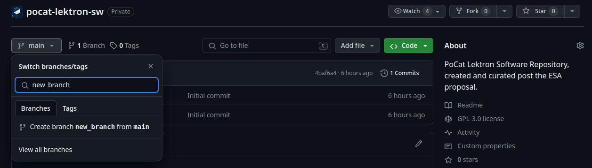

# <sup>po</sup>CAT Lektron — Flight Software

<<<<<<< HEAD
This Readme is under development.

The compiler architecture is being migrated from STM32CubeIDE to CMake.
=======
Flight software for the <sup>po</sup>CAT PocketQube, developed at the Nano-Satellite and Payload
Laboratory ([NanoSat Lab](https://nanosatlab.upc.edu/en)), Universitat Politècnica de Catalunya —
UPC BarcelonaTech, as part of the IEEE Open PocketQube Kit.

The application is a FreeRTOS-based system running on an **STM32L476RG** (Cortex-M4F, 80 MHz,
1 MB flash / 128 KB SRAM). Each satellite subsystem — OBC, COMMS, ADCS, EPS and the two payloads —
is implemented as an independent RTOS task that exchanges task notifications, event-group flags and
queue messages with the others.

Extended project documentation lives in the
[NanoSat Lab wiki](https://wiki.nanosatlab.space/shelves/ieee-open-pocketqube-kit).

---

## Table of contents

1. [Status](#status)
2. [Hardware](#hardware)
3. [Software architecture](#software-architecture)
   - [Task table](#task-table)
   - [Inter-task communication](#inter-task-communication)
   - [Non-volatile memory map](#non-volatile-memory-map)
4. [Repository layout](#repository-layout)
5. [Getting started](#getting-started)
   - [Toolchain](#toolchain)
   - [Clone, build and flash](#clone-build-and-flash)
   - [Git workflow](#git-workflow)
6. [Debugging tips](#debugging-tips)
7. [Coding conventions](#coding-conventions)
8. [License](#license)

---

## Status

This repository holds code that is either validated or actively under development. Maturity varies a
lot between subsystems, so read `Core/Src/main.c` before assuming a subsystem runs.

Only a subset of the tasks is created at boot; the rest are present in the source but commented out
in `main()` (`Core/Src/main.c:132`):

| Task      | Created at boot | Notes                                                        |
|-----------|-----------------|--------------------------------------------------------------|
| `FLASH`   | Yes             | Gatekeeper for all non-volatile writes.                      |
| `COMMS`   | Yes             | SX1262 LoRa link, telecommand handling, beacon.              |
| `PAYLOAD` | Yes             | VGA camera capture over UART4.                               |
| `OBC`     | No              | State machine implemented, marked "to be reworked".          |
| `ADCS`    | No              | Task skeleton only; the algorithm bodies are still comments. |
| `EPS`     | No              | Battery state machine drafted, sensor reads not wired.       |
| `RFI`     | No              | RFI payload; driver code exists, task disabled.              |
| `sTIM`    | No              | Duty-cycle scheduler that suspends/resumes subsystem tasks.  |

Two things in `main()` are worth knowing before you touch it:

- `vTaskStartScheduler()` at `Core/Src/main.c:158` never returns, so the CMSIS-v1 `defaultTask`
  created below it is dead code left over from the CubeMX template.
- Re-generating code from `pocat-sw.ioc` rewrites `main.c`. Keep every hand-written line inside the
  `/* USER CODE BEGIN ... */` / `/* USER CODE END ... */` markers or it will be lost.

## Hardware

| Item            | Value                                                            |
|-----------------|------------------------------------------------------------------|
| MCU             | STM32L476RGT3, LQFP64                                             |
| Clock           | 80 MHz SYSCLK (HSI 16 MHz → PLL ×10 / ÷2), LSI for the RTC        |
| HAL / firmware  | STM32Cube FW_L4 V1.17.1                                           |
| RTOS            | FreeRTOS via CMSIS-OS v1, 73 000-byte heap, 9 priority levels     |
| Radio           | Semtech SX1262 on `SPI2` (PB12–PB15)                              |
| Camera payload  | UART4 (PC10/PC11) with circular DMA on RX                         |
| RFI payload     | `ADC1` sampling + `DAC1` VCO tuning (5600–7000 MHz sweep)         |
| Sensor bus      | `I2C1` (PB6/PB7)                                                  |
| Timebase        | `TIM2` for the HAL tick; `TIM5/7/16/17` for application timing    |
| Debug           | SWD on PA13/PA14 (ST-Link V2)                                     |

The authoritative pin configuration is `pocat-sw.ioc` — open it in STM32CubeIDE rather than editing
the generated initialisation code by hand.

## Software architecture

### Task table

Stack sizes and priorities are defined in `Subsystems/OBC/Inc/obc.h`. Higher number = higher
priority.

| Task      | Priority | Stack (words) | Entry point                        |
|-----------|----------|---------------|------------------------------------|
| `sTIM`    | 8        | 1000          | `sTIM_Task` (`main.c`)             |
| Daemon    | 7        | 500           | FreeRTOS timer service task        |
| `FLASH`   | 6        | 9000          | `FLASH_Task` (`main.c`)            |
| `PAYLOAD` | 5        | 4000          | `PAYLOAD_Task` → `camerav2.c`      |
| `ADCS`    | 4        | 250           | `ADCS_Task` (`main.c`)             |
| `EPS`     | 3        | 250           | `EPS_Task` (`main.c`)              |
| `OBC`     | 2        | 1000          | `OBC_Task` → `obc.c`               |
| `COMMS`   | 1        | 3000          | `COMMS_Task` → `COMMS_StateMachine`|

**Duty cycling.** `sTIM_Task` owns one software timer per subsystem. When a timer fires it flips the
task between its active and suspended period (both 3000 ms by default, `obc.h:85`), suspends or
resumes the task, and re-arms the timer. This keeps average power draw down without giving each
subsystem its own sleep logic.

**OBC state machine.** `OBC_Task` reads the persisted state from `CURRENT_STATE_ADDR` and dispatches
to `OBC_Nominal`, `OBC_Contingency`, `OBC_Sunsafe` or `OBC_Survival`. Transitions are driven by the
battery level evaluated in `EPS_Task` and by ground telecommands received through COMMS.

**COMMS state machine.** `COMMS_StateMachine` (`Subsystems/COMMS/comms.c:101`) cycles through
`STARTUP → SLEEP → STDBY → RX → TX`. The link is LoRa at 868 MHz, SF11, CR 4/5, 125 kHz bandwidth,
18 dBm, with optional Channel Activity Detection to avoid keeping the receiver on. Telecommands are
enumerated as `telecommandIDS` in `Subsystems/COMMS/Inc/comms.h` and cover state transitions,
configuration uploads, payload scheduling, downlink control and reboots.

> `COMMS_DEBUG_MODE` is set to `1` in `comms.c`. That forces continuous reception and disables the
> sleep path — set it to `0` for flight-representative power behaviour.

### Inter-task communication

Three mechanisms are used, each for a distinct purpose:

- **Task notifications** — 32 event bits defined in `CommonResources/Inc/notifications.h`, one bit
  per command (`TAKEPHOTO_NOTI`, `DETUMBLING_NOTI`, `EPS_BATTERY_NOTI`, …). The header comments
  record the intended sender and receiver for every bit.
- **Event group** `xEventGroup` — blocking synchronisation flags such as
  `COMMS_RXIRQFlag_EVENT`, `ADCS_POINTINGDONE_EVENT` and `PAYLOAD_TIMEFORPHOTO_EVENT`
  (`Subsystems/OBC/Inc/obc.h:121`).
- **Queue** `FLASH_Queue` — a 10-deep FIFO of `QueueData_t` descriptors (pointer, length, target
  address, sender). `FLASH_Task` is the only writer to non-volatile memory; everything else calls
  `Send_to_WFQueue()`. Payloads larger than 2000 bytes are split into 2000-byte chunks before being
  written.

### Non-volatile memory map

Addresses live in `CommonResources/Inc/flash.h`. Application data starts at `0x0803_0000`, well
above the code region:

| Region                  | Base address  | Contents                                          |
|-------------------------|---------------|---------------------------------------------------|
| State machine           | `0x0803_0000` | Current/previous OBC state, deployment flags      |
| Time                    | `0x0803_0008` | Ground-set time and RTC-derived Unix time         |
| Configuration           | `0x0803_0010` | ADCS gain, gyro resolution, photo and RFI config  |
| TLE                     | `0x0803_0020` | Two 69-character TLE lines (138 bytes)            |
| Calibration             | `0x0803_00AB` | Magnetometer matrix/offset, gyro polynomial       |
| Telemetry               | `0x0803_0100` | Temperatures, battery, gyro, magnetometer, photodiodes |
| COMMS counters          | `0x0803_0200` | Packet/window/retransmission counters, timeout    |
| EPS thresholds          | `0x0803_0800` | Nominal / contingency / sunsafe / survival levels  |
| RFI config              | `0x0803_1000` | RFI sweep parameters                              |
| Photo buffer            | `0x0804_0000` | Captured image                                    |
| Telemetry history       | `0x080F_EFFF` | Ring of ~89 historical telemetry records          |

## Repository layout

```
├── Core/                 # CubeMX-generated: main.c, freertos.c, IT handlers, startup, HAL config
├── Drivers/              # CubeMX-generated: STM32L4xx HAL + CMSIS
├── Middlewares/          # FreeRTOS kernel
├── Semtech/              # SX126x radio driver and its STM32 board-support layer
├── CommonResources/      # Shared across subsystems
│   ├── flash.c           #   non-volatile read/write and the memory map
│   └── Inc/
│       ├── definitions.h #   packed telemetry unions, subsystem/state enums
│       └── notifications.h #  task-notification bit assignments
├── Subsystems/
│   ├── OBC/              # State machine, clock scaling, peripheral gating, software timers
│   ├── COMMS/            # LoRa state machine, packet build/parse, telecommand dispatch
│   ├── ADCS/             # SGP4 propagator, IGRF-13 magnetic model, detumbling helpers
│   ├── VGA/              # camerav2.c — UART camera driver
│   └── RFI/              # RFI detection payload (statistical / time / frequency algorithms)
├── doc/                  # Coding conventions, license, images
├── pocat-sw.ioc          # CubeMX pin and peripheral configuration — source of truth
└── STM32L476RGTX_*.ld    # Linker scripts (flash and RAM targets)
```

Each subsystem directory follows the same pattern: a `<subsystem>.c` entry file, an `Inc/` folder
with its headers, and any supporting libraries alongside.

The `Debug/` folder appears after the first build and is git-ignored — do not commit it.

## Getting started

### Toolchain

| Tool | Version | Where |
|------|---------|-------|
| STM32CubeIDE | 1.13.2 | [st.com](https://www.st.com/en/development-tools/stm32cubeide.html) |
| GNU Arm Embedded Toolchain | 9-2020-q2-update | [developer.arm.com](https://developer.arm.com/downloads/-/gnu-rm/9-2020-q2-update) |
| Git | any recent | [git-scm.com](https://git-scm.com/downloads) — Windows users may prefer [GitHub Desktop](https://desktop.github.com/) |
| ST-Link V2 | — | Ask a contributor for one |

Pinning the IDE and toolchain versions matters: CubeIDE regenerates code from the `.ioc`, and a
different generator version produces a large, noisy diff.

### Clone, build and flash

Clone over SSH ([key setup instructions](https://docs.github.com/en/authentication/connecting-to-github-with-ssh)):

```bash
git clone git@github.com:nanosatlab/pocat-lektron-sw.git
cd pocat-lektron-sw
```

Then, in STM32CubeIDE:

1. **File → Open Projects from File System…** and select the cloned folder. The `.project` and
   `.cproject` files are committed, so the project imports ready to build.
2. **Project → Build Project** (`Ctrl+B`). Output lands in `Debug/pocat-sw.elf`.
3. Connect the ST-Link V2 to the SWD header (PA13 = SWDIO, PA14 = SWCLK, plus GND).
4. **Run → Debug** using the committed `pocat-sw Debug.launch` configuration, which builds, flashes
   and halts at `main`.

### Git workflow

Branch from `main` — either from the GitHub web UI or locally:



```bash
git branch -a                   # list local and remote branches
git switch <branch-name>        # move to an existing branch
git switch -c <branch-name>     # create a new one

git status                      # review what changed
git add --all
git commit -m "your message"
git push
```

Open a pull request against `main` when the branch is ready for review.

## Debugging tips

### `printf` to the SWV console

Add a `_write` retarget inside the user-code section of `main.c`:

```c
/* USER CODE BEGIN 4 */
int _write(int file, char *ptr, int len)
{
    int DataIdx;
    for (DataIdx = 0; DataIdx < len; DataIdx++)
    {
        ITM_SendChar(*ptr++);
    }
    return len;
}
/* USER CODE END 4 */
```

Then in the IDE: **Window → Show View → SWV → SWV ITM Data Console → Configure trace**, enable
port 0, and press the red record button. `printf("Hi, Lektron team");` now reaches the console.

Note that SWV requires the correct core clock (80 MHz) in the debug configuration, and that the
committed launch file has SWV disabled by default.

### Printing floats

Newlib's reduced `printf` omits float formatting, so this fails silently or raises:

```
The float formatting support is not enabled, check your MCU Settings from
"Project Properties > C/C++ Build > Settings > Tool Settings",
or add manually "-u _printf_float" in linker flags.
```

Either format into a buffer first:

```c
snprintf(temperature_buff, sizeof(temperature_buff), "Temperature: %.2f", real_temperature);
```

or enable float support under **Project → Properties → C/C++ Build → Settings → Tool Settings →
MCU GCC Linker → Miscellaneous → Other flags**, adding `-u _printf_float`. Be aware this pulls in a
few kB of extra code.

## Coding conventions

The project follows the [GNU C coding standards](https://www.gnu.org/prep/standards/html_node/Writing-C.html),
summarised with project-specific notes in [`doc/CodingConventions.md`](doc/CodingConventions.md).

## License

This project was developed at the Nano-Satellite and Payload Laboratory (NanoSat Lab), Universitat
Politècnica de Catalunya — UPC BarcelonaTech.

Released under the **GNU GPL v3**; see [`doc/LICENSE`](doc/LICENSE).

Third-party components keep their own licenses: the STM32 HAL, CMSIS and CubeMX-generated code are
BSD-3-Clause (STMicroelectronics, see the `LICENSE` files under `Drivers/`), FreeRTOS is MIT
(`Middlewares/Third_Party/FreeRTOS/Source/LICENSE`), and the SX126x driver is Revised BSD
(© 2013–2017 Semtech, per the file headers in `Semtech/`).
>>>>>>> 39c55f4 (Readme created)
